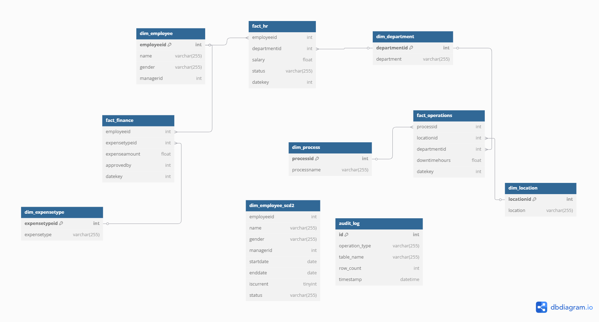

 Data Warehousing Assignment

## Project Overview
This project implements a data warehousing solution for organizational insights. It processes data from HR, Finance, and Operations domains, applies transformations, and loads it into a MySQL database for analysis.

## Tools & Technologies Used

- **Python** (ETL development using pandas)
- **MySQL** (data warehouse simulation)
- **SQL** (views, filters, role-based access)
- **GitHub** (version control and project showcase) 
---

## Project Folder Structure

```
organizational-insights-data-warehouse/
├── data/           # Raw Excel files
├── etl/            # ETL, SCD Type 2, audit logging and incremental scripts
├── sql/            # SQL db and view scripts
├── notebooks/      # .py scripts for KPI
├── docs/           # schema diagrams or descriptions
└── README.md       # Project documentation
```

## ETL Pipelines Overview

Each business area has its own ETL script responsible for data cleaning, transformation, and loading into a star schema format with incremental loading, audit logging and SCD type 2. Additionally, there is a Master ETL script that consolidates the functionality of the individual scripts, performing all tasks in a single workflow.  
 
| Domain     | Script                  | Fact Table        | Dimensions Used                          |
|------------|-------------------------|-------------------|------------------------------------------|
| HR         | `etl/hr_etl.py`         | `fact_hr`         | `dim_employee`, `dim_department`         |
| Finance    | `etl/finance_etl.py`    | `fact_finance`    | `dim_expensetype`                        |
| Operations | `etl/operations_etl.py` | `fact_operations` | `dim_process` ,'`dim_location`'          |


## Star Schema Diagram


## KPI Metrics Summary

Key business metrics were computed using `.py` scripts — located in the `notebooks/` folder.

| Domain     | KPIs Generated                                              |
|------------|-------------------------------------------------------------|
| HR         | Headcount, Attrition Rate, Average Salary by Gender         |
| Finance    | Monthly Expenses by Expense Type                            |
| Operations | Total Downtime by Process and Department                    |

---

## Role-Based Access (Simulated Using SQL Views)

This project simulates access control by creating SQL views for each user role in the MySQL database.

| Role            | SQL View Name             | Access Permissions            |
|-----------------|---------------------------|-------------------------------|
| HR User         | `view_hr_user`            | Employee data and HR mertics  |
| Finance User    | `view_finance_user`       | Expenses and Financial metrics|
| Operations User | `view_Operations_user`    | Process and Downtime metrics  |
| Super User      | All views/tables          | Full access to all data       |

Views are defined inside `sql/role_views.sql` and created using `create_views.py`: Creates role-based SQL views in MySQL

## Setup Instructions

### 1. Clone the repository

```bash
git clone https://github.com/vamsiram7/DataWarehousingAssignment.git
cd DataWarehousingAssignment
```
### 2. Prerequisites
- Python 3.12
- MySQL Server

### 3. Install required Python packages

```bash
pip install -r requirements.txt
```
### 4. Setting Up MySQL
- Install MySQL Server and ensure it is running.
- Update the MySQL credentials in `sql/db_config.ini`:
   ```ini
   [mysql]
   host = localhost
   user = your_username
   password = your_password
   database = organizational_insights
   ```

## 5. Setting Up MySQL Locally and MySQL Workbench

### For macOS

1. **Install MySQL**:
   - Use Homebrew to install MySQL:
     ```bash
     brew install mysql
     ```
   - Alternatively, download the MySQL Community Server from the [official MySQL website](https://dev.mysql.com/downloads/mysql/).

2. **Start the MySQL Service**:
   - If installed via Homebrew, start the MySQL service:
     ```bash
     brew services start mysql
     ```
   - If installed manually, start MySQL using the system preferences or terminal commands provided during installation.

3. **Secure the MySQL Installation**:
   - Run the following command to secure your MySQL installation:
     ```bash
     mysql_secure_installation
     ```
   - Follow the prompts to set a root password and secure the installation.

4. **Log in to MySQL**:
   - Use the following command to log in as the root user:
     ```bash
     mysql -u root -p
     ```
   - Enter the password you set during the secure installation process.

5. **Install MySQL Workbench**:
   - Download MySQL Workbench from the [official website](https://dev.mysql.com/downloads/workbench/).
   - Open the downloaded `.dmg` file and follow the installation instructions.
   - Connect to your MySQL server using `localhost`, port `3306`, and the root credentials.

---

### For Windows

1. **Install MySQL**:
   - Download the MySQL Community Server from the [official MySQL website](https://dev.mysql.com/downloads/mysql/).
   - Run the installer and follow the setup wizard.
     - Select "Developer Default" or "Custom" setup type.
     - Ensure that "MySQL Server" and "MySQL Workbench" are selected.
   - Set a root password during the installation process.

2. **Start MySQL**:
   - Open the MySQL Command Line Client from the Start menu.
   - Log in using the root password you set during installation.

3. **Secure the MySQL Installation**:
   - Open a terminal or command prompt and run:
     ```bash
     mysql_secure_installation
     ```
   - Follow the prompts to secure your installation.

4. **Log in to MySQL**:
   - Use the following command to log in as the root user:
     ```bash
     mysql -u root -p
     ```
   - Enter the password you set during the secure installation process.

5. **Install MySQL Workbench**:
   - If not installed during the MySQL setup, download it from the [official website](https://dev.mysql.com/downloads/workbench/).
   - Install and open MySQL Workbench.
   - Connect to your MySQL server using `localhost`, port `3306`, and the root credentials.

---

### Additional Notes

- Ensure that `mysql-connector-python` is installed in your Python environment to connect to MySQL from Python scripts:
  ```bash
  pip install mysql-connector-python
  ```
- Use MySQL Workbench to visually inspect your database and verify the data loaded by your ETL scripts.

## 6. Workflow Execution

### 6.1. Create a Database

Create a new database for your project:

     mysql -u root -p
     CREATE DATABASE IF NOT EXISTS organizational_insights;
     

### 6.2. Run ETL scripts

Run the following ETL script to get cleaned fact and dimension tables loaded into the database:
```bash
python etl/master_etl.py
```

### 6.3. Generate KPI
You can view KPIs by running the following Python scripts:

```bash
python notebooks/hr_kpi.py
python notebooks/finance_kpi.py
python notebooks/operations_kpi.py
```
### 6.4. Role Based Views
Generate the role-based views in MySQL by running the following script:
```bash
python sql/create_views.py
```
